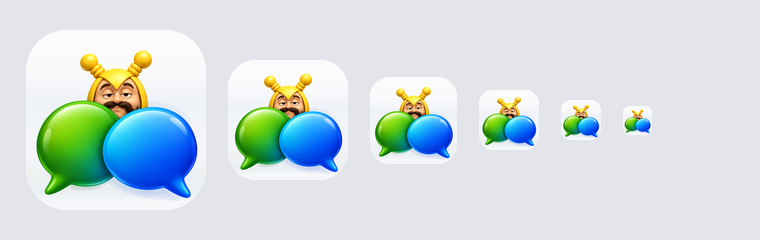

# Chatman

Signal en WhatsApp op je Apple Watch, zonder je telefoon.

Chatman is een Matrix-client die maar één ding goed wil doen: berichten lezen en
sturen vanaf een Apple Watch met eigen mobiele verbinding, via de bruggen van
[mautrix](https://github.com/mautrix) op je eigen server. De iPhone-app hoort
erbij, maar de watch-app is het punt — Signal en WhatsApp hebben er zelf geen.

Geen accounts bij derden, geen analytics, geen abonnement. Je berichten staan op
een server die van jou is.



## Wat het doet

- Gesprekken, groepen, foto's, video's, GIF's, spraakberichten en reacties
- Antwoorden, bewerken, doorsturen, verwijderen — inclusief wat anderen doen
- Bijlagen openen: pdf's en de rest, in Quick Look
- Ontvangst- en leesbewijzen, zoals in Berichten
- Je locatie delen: eerst op de kaart bekijken, dan versturen als link die in elke
  kaartenapp opengaat
- Zoeken door gesprekken én berichten; archiveren wat je niet dagelijks nodig hebt
- Een complicatie op de wijzerplaat met het aantal ongelezen gesprekken, die zich
  ook bijwerkt als de app dicht is
- Namen en foto's uit je eigen adresboek in plaats van telefoonnummers, met een
  handmatige keuze voor wie daar niet op te vinden is
- Veertien netwerken, als je de bijbehorende brug draait: Signal, WhatsApp,
  Telegram, Messenger, Instagram, Discord, Slack, Google Messages, Google Voice,
  X, LinkedIn, Bluesky, IRC en Zulip

Wat het bewust **niet** doet: versleutelde Matrix-kamers lezen, en iMessage.
Voor het eerste zou de watch-app een sleutelbos moeten beheren die hij niet kan
beheren; voor het tweede is een Mac nodig die altijd aan staat.

## Wat je nodig hebt

- Een eigen Matrix-server (Synapse) met minstens één mautrix-brug
- Een Mac met Xcode 26 of nieuwer
- Een iPhone met iOS 26 en, als je hem wilt gebruiken, een Apple Watch met
  watchOS 26

Een gratis Apple-ontwikkelaarsaccount is genoeg om het op je eigen apparaten te
zetten. Wat je daarmee niet krijgt: pushmeldingen en App Groups. Chatman werkt
daar omheen — de watch haalt zelf berichten op en de complicatie leest het aantal
uit de keychain.

De meldingen zelf zijn wel gebouwd. Zet je een push-gateway (Sygnal) op je server
en bouw je met een betaald account, dan vul je het adres in onder Instellingen →
Geavanceerd en zet je de schakelaar om. Op een gratis account weigert Apple het
token, en dat staat er dan ook zo: "Not available in this build" in plaats van een
schakelaar die stilletjes niets doet.

### Op jouw server

Chatman gaat uit van jouw server, niet van die van iemand anders. Er staat nergens
een adres in de code: bij het inloggen vul je gebruikersnaam, server en poort zelf
in, en `.well-known` zoekt de rest op. Twee dingen kunnen bij jou anders liggen.

**Waar de bruggen luisteren.** Elke mautrix-brug heeft een eigen
provisioning-adres, en waar dat uitkomt hangt af van je reverse proxy. Standaard
zoekt Chatman op `/bridge/{network}` — dus `/bridge/signal`, `/bridge/whatsapp`,
enzovoort. Heb jij het anders ingericht, pas het dan aan onder **Instellingen →
Geavanceerd → Bridge-pad**. Krijg je bij het toevoegen van een koppeling geen
aanmeldscherm te zien, dan is dit vrijwel altijd de reden.

**Uitnodigingen.** Een brug maakt per gesprek een kamer aan en nodigt je uit;
negeer je die, dan blijft je lijst leeg. Chatman neemt daarom uitnodigingen van
een brug-account of een van zijn ghosts zonder vragen aan. Van ieder ander niet:
die verschijnen bovenaan je lijst met **Join** en **Decline**.

Dat onderscheid bestaat omdat de app oorspronkelijk voor één server geschreven is
— registratie dicht, federation uit — waar je eigen brug de enige was die je kón
uitnodigen. Draait jouw server wél mee met de rest van Matrix, dan zou een
vreemde anders zomaar tussen je chats staan.

Gebruikt jouw brug een ongebruikelijke accountnaam, dan herkent Chatman hem niet
als brug en komen die kamers als uitnodiging binnen in plaats van vanzelf. Dat is
zichtbaar en op te lossen met één tik — niet stil kapot.

### Een scherm bekijken zonder server

Half de app zit achter een inlog. Voor ontwerpwerk opent een startargument elk
scherm met verzonnen gesprekken erin, zonder server en zonder account:

```bash
xcrun simctl launch <simulator> com.example.Chatman --design-preview settings
```

Kies uit `settings`, `conversation` of `list`. Zonder dat argument is er niets van
te zien of te bereiken.

## Zelf draaien

1. **Server.** `server/matrix-stack.example.yml` is de hele stack: Synapse,
   Postgres, Traefik en de bruggen voor Signal en WhatsApp. Vul de geheimen in
   (zie [server/README.md](server/README.md)) en rol hem uit met Docker Compose
   of Portainer.
2. **App.** Open `Chatman.xcodeproj`, kies je eigen team bij Signing, en
   verander de bundle-ID's van de vier targets in iets van jezelf. De keychain-
   groep past zich vanzelf aan.
3. **Inloggen.** Start de app, vul je gebruikersnaam, serveradres en poort in.
   Poort 443 staat voorgevuld; gebruik je iets anders, dan vul je dat daar in.
4. **Koppelen.** Instellingen → Account toevoegen → Signal of WhatsApp, en scan
   de code met je telefoon.

De app zoekt de bruggen op `https://jouwserver/bridge/<netwerk>/`. Routeert jouw
server ze ergens anders, dan pas je dat aan onder Instellingen → Geavanceerd.

Een brug erbij zetten: `server/nieuwe-brug.sh telegram` schrijft alle blokken
uit die je in je stack moet plakken, met verse tokens.

## Bouwen en testen

```bash
swift test --package-path ChatmanKit
./installeer.sh
```

`ChatmanKit` is een gewoon Swift-pakket zonder afhankelijkheden: alles wat te
testen valt — het decoderen van events, de sync, de bruggen, de emoji-regels —
zit daar en draait zonder simulator. `installeer.sh` bouwt en installeert op een
aangesloten iPhone én de gekoppelde watch; de UDID's bovenin zijn van mijn
apparaten en moet je vervangen door die van jezelf (`xcrun devicectl list
devices`).

## Licentie

MIT. Zie [LICENSE](LICENSE).

Chatman zelf — het personage met de snor — is een reclamefiguur van een
Nederlandse provider uit het MSN-tijdperk. De tekening in deze repo is een eigen
interpretatie en hoort bij dit project, niet bij hen.
